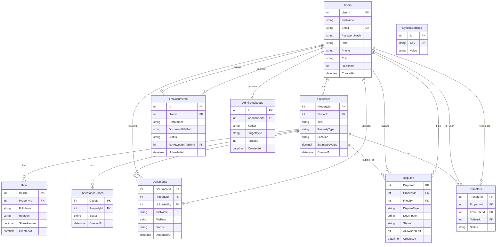
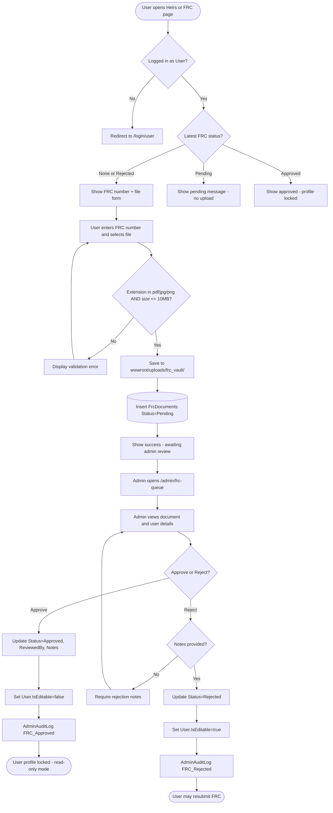
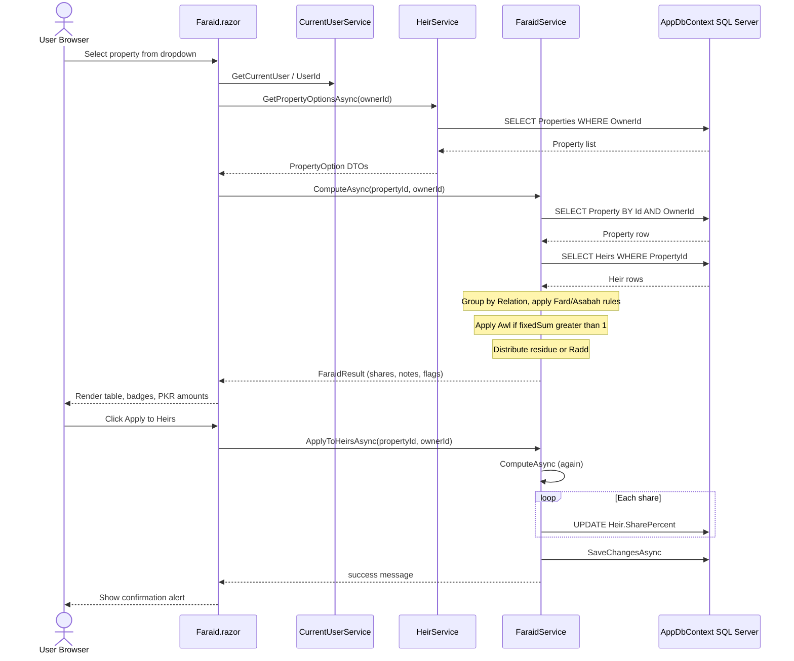

# MirasPro Inheritance System — Project Manual

**Version:** 1.0  
**Product:** MirasPro (Miras = inheritance; Pro = professional platform)  
**Stack:** ASP.NET Core Blazor Server · C# · Entity Framework Core · SQL Server  
**Target framework:** .NET 10.0  
**Document date:** May 2026  

---

## Table of Contents

1. [Introduction & Purpose](#1-introduction--purpose)
   - 1.1 [Executive Summary](#11-executive-summary)
   - 1.2 [Societal Value & Problem Statement](#12-societal-value--problem-statement)
   - 1.3 [Design Principles](#13-design-principles)
   - 1.4 [Scope & Limitations](#14-scope--limitations)
2. [System Architecture & Technology Stack](#2-system-architecture--technology-stack)
   - 2.1 [High-Level Architecture](#21-high-level-architecture)
   - 2.2 [Blazor Server Runtime Model](#22-blazor-server-runtime-model)
   - 2.3 [Layered Application Structure](#23-layered-application-structure)
   - 2.4 [Service Registration & Dependency Injection](#24-service-registration--dependency-injection)
   - 2.5 [Routing & Page Map](#25-routing--page-map)
   - 2.6 [Use Case Diagram (User vs Administrator)](#26-use-case-diagram-user-vs-administrator)
3. [Database Schema Overview](#3-database-schema-overview)
   - 3.1 [Database Name & Provisioning](#31-database-name--provisioning)
   - 3.2 [Entity Relationship Model](#32-entity-relationship-model)
   - 3.3 [Table Reference](#33-table-reference)
   - 3.4 [Cascade Rules & Integrity](#34-cascade-rules--integrity)
   - 3.5 [Schema Migration on Startup](#35-schema-migration-on-startup)
4. [Authentication & Role-Based Access Control](#4-authentication--role-based-access-control)
   - 4.1 [Roles](#41-roles)
   - 4.2 [Registration Workflows](#42-registration-workflows)
   - 4.3 [Login Workflows](#43-login-workflows)
   - 4.4 [Session Management](#44-session-management)
   - 4.5 [Record Editability (`IsEditable`)](#45-record-editability-iseditable)
5. [User Guide — The User Portal](#5-user-guide--the-user-portal)
   - 5.1 [Getting Started](#51-getting-started)
   - 5.2 [Dashboard](#52-dashboard)
   - 5.3 [Property Management](#53-property-management)
   - 5.4 [Heir Management](#54-heir-management)
   - 5.5 [Family Registration Certificate (FRC)](#55-family-registration-certificate-frc)
   - 5.6 [Document Management](#56-document-management)
   - 5.7 [Faraid Calculator (User Flow)](#57-faraid-calculator-user-flow)
   - 5.8 [Dispute Management](#58-dispute-management)
   - 5.9 [Compliance Indicators](#59-compliance-indicators)
6. [Admin Guide — The Admin Console](#6-admin-guide--the-admin-console)
   - 6.1 [Administrator Access](#61-administrator-access)
   - 6.2 [Admin Console Dashboard](#62-admin-console-dashboard)
   - 6.3 [FRC Verification Workflow](#63-frc-verification-workflow)
   - 6.4 [Activity Diagram — FRC Upload & Admin Verification](#64-activity-diagram--frc-upload--admin-verification)
   - 6.5 [User Management](#65-user-management)
   - 6.6 [Property & Document Oversight](#66-property--document-oversight)
   - 6.7 [Dispute Review](#67-dispute-review)
   - 6.8 [Compliance Overview](#68-compliance-overview)
   - 6.9 [Security Settings & Audit Logs](#69-security-settings--audit-logs)
7. [Core Algorithms — Faraid Calculator](#7-core-algorithms--faraid-calculator)
   - 7.1 [Islamic Inheritance Concepts](#71-islamic-inheritance-concepts)
   - 7.2 [Supported Heir Relations](#72-supported-heir-relations)
   - 7.3 [Computation Pipeline](#73-computation-pipeline)
   - 7.4 [Awl (Increase of Denominator)](#74-awl-increase-of-denominator)
   - 7.5 [Radd (Return of Surplus)](#75-radd-return-of-surplus)
   - 7.6 [Applying Shares to the Database](#76-applying-shares-to-the-database)
   - 7.7 [Sequence Diagram — Faraid Calculation](#77-sequence-diagram--faraid-calculation)
8. [Security & Compliance](#8-security--compliance)
   - 8.1 [Password Hashing](#81-password-hashing)
   - 8.2 [Protected Session Storage](#82-protected-session-storage)
   - 8.3 [Administrator Security Key](#83-administrator-security-key)
   - 8.4 [File Upload Validation](#84-file-upload-validation)
   - 8.5 [Authorization Patterns in the UI](#85-authorization-patterns-in-the-ui)
9. [Deployment & Configuration](#9-deployment--configuration)
   - 9.1 [Prerequisites](#91-prerequisites)
   - 9.2 [Database Setup](#92-database-setup)
   - 9.3 [Connection String Configuration](#93-connection-string-configuration)
   - 9.4 [Running the Application](#94-running-the-application)
   - 9.5 [Upload Directories](#95-upload-directories)
   - 9.6 [Optional Seed Data](#96-optional-seed-data)
10. [Appendices](#10-appendices)
    - 10.1 [Project Folder Structure](#101-project-folder-structure)
    - 10.2 [NuGet Dependencies](#102-nuget-dependencies)
    - 10.3 [Legal Disclaimer](#103-legal-disclaimer)

---

## 1. Introduction & Purpose

### 1.1 Executive Summary

**MirasPro** is a secure, Sharia-aware digital platform for managing inheritance-related property records, legal heirs, Islamic share calculation (Faraid), family verification documents, and administrative dispute resolution. The system is implemented as a **Blazor Server** web application backed by **SQL Server**, with business logic encapsulated in scoped C# services and persistence handled through **Entity Framework Core**.

End users register real-world assets (residential, commercial, agricultural, and digital), attach heirs with Quranic/legal relationships, upload compliance documents (including the Family Registration Certificate), and run an automated Faraid engine that distributes estate value according to Hanafi-oriented rules—including **Awl** and **Radd** adjustments. Administrators operate a separate console to verify FRC submissions, review property documents and disputes, lock user profiles after verification, rotate security keys, and maintain a tamper-evident audit trail.

### 1.2 Societal Value & Problem Statement

In many jurisdictions—including Pakistan under frameworks such as the **Muslim Family Laws Ordinance, 1961**—inheritance disputes arise from:

- Informal or incomplete documentation of heirs and assets  
- Manual, error-prone Faraid calculations when multiple fixed sharers coexist  
- Lack of a single auditable record linking properties, heirs, and verified family status  

MirasPro addresses these gaps by:

1. Centralizing property and heir data per owner  
2. Enforcing a structured FRC verification gate before profiles are locked  
3. Automating share computation with explicit flags when Awl or Radd applies  
4. Providing administrators tools to approve, reject, and log every consequential action  

### 1.3 Design Principles

| Principle | Implementation in MirasPro |
|-----------|---------------------------|
| **Separation of roles** | Distinct login portals (`/login/user`, `/login/admin`), role checks in `UserService` and `CurrentUserService` |
| **Server-side truth** | Faraid, FRC, and compliance logic run in C# services—not client-only JavaScript |
| **Least privilege for users after verification** | `User.IsEditable = false` after FRC approval; users may add new records but not edit/delete existing ones |
| **Auditability** | `AdminAuditLog` records FRC approvals/rejections and other admin actions |
| **Progressive compliance** | `ComplianceService` surfaces missing FRC, pending review, or per-property documents |

### 1.4 Scope & Limitations

**In scope (as implemented):**

- User and Administrator accounts with BCrypt password storage  
- CRUD for properties and heirs (subject to `IsEditable`)  
- Faraid calculation for a defined set of Quranic/Asabah relations (Hanafi-oriented rules in `FaraidService`)  
- FRC upload and admin approve/reject with profile lock/unlock  
- Property document upload (10 MB limit) and admin review via `ComplianceService`  
- Dispute filing and admin status workflow (`Pending`, `Under Review`, `Approved`, `Rejected`)  

**Out of scope / disclaimers:**

- The Faraid module is an **educational/assistive tool**, not a substitute for a qualified Islamic scholar or court order (see UI disclaimer on `/faraid`)  
- Relations such as *Paternal Uncle* appear in the heir dropdown but are **not** computed by `FaraidService` unless mapped—they may show as excluded  
- `Transfers` and `AdminRegistrationInvites` tables exist in the schema; transfer UI may be limited to property detail display  
- No third-party identity provider (OAuth); authentication is email + password + session  

---

## 2. System Architecture & Technology Stack

### 2.1 High-Level Architecture

```
┌─────────────────────────────────────────────────────────────────┐
│                     Browser (User / Admin)                       │
└────────────────────────────┬────────────────────────────────────┘
                             │ SignalR (Blazor Server circuit)
                             ▼
┌─────────────────────────────────────────────────────────────────┐
│  ASP.NET Core Host (Program.cs)                                  │
│  ┌──────────────┐  ┌──────────────────────────────────────────┐ │
│  │ Razor Pages  │  │ Scoped Services                          │ │
│  │ Components   │──│ UserService, PropertyService, FaraidSvc, │ │
│  │ (.razor)     │  │ FrcService, AdminService, ComplianceSvc  │ │
│  └──────────────┘  └──────────────────┬───────────────────────┘ │
│  ┌──────────────┐                     │                          │
│  │ CurrentUser  │ ProtectedSessionStorage (encrypted browser)    │
│  │ Service      │                                                    │
│  └──────────────┘                     ▼                          │
│                        ┌─────────────────────────┐               │
│                        │ AppDbContext (EF Core)   │               │
│                        └────────────┬────────────┘               │
└─────────────────────────────────────┼────────────────────────────┘
                                      │ TDS / SQL
                                      ▼
                        ┌─────────────────────────┐
                        │ SQL Server (InheritanceDB)│
                        └─────────────────────────┘
                                      │
                        ┌─────────────┴─────────────┐
                        │ wwwroot/uploads/          │
                        │  documents/  frc_vault/   │
                        └───────────────────────────┘
```

### 2.2 Blazor Server Runtime Model

MirasPro uses **Interactive Server** render mode on authenticated pages (e.g. `@rendermode @(new InteractiveServerRenderMode(prerender: false))`). User events (button clicks, form posts, file uploads) are sent over a **SignalR** circuit to the server; UI updates are diffed back to the browser. Implications:

- Business logic and database access always execute on the server  
- Session state for the logged-in user is held in `CurrentUserService` plus **ProtectedSessionStorage**  
- File uploads stream to the server before being written under `wwwroot/uploads/`  

### 2.3 Layered Application Structure

| Layer | Location | Responsibility |
|-------|----------|----------------|
| **Presentation** | `Components/Pages/`, `Components/Shared/` | Razor UI, navigation, forms |
| **Application services** | `Services/*.cs` | Transactions, validation, Faraid, FRC, disputes |
| **Domain models** | `Models/*.cs` | EF entities and annotations |
| **Infrastructure** | `Data/AppDbContext.cs`, `Services/DatabaseSchemaInitializer.cs` | EF Core mappings, schema patches |
| **Scripts** | `Scripts/MirasPro_FullDatabase.sql` | Full database bootstrap |

Namespaces: UI/services often use `inheritance_system`; entities use `InheritanceSystem.Models` and `InheritanceSystem.Data`.

### 2.4 Service Registration & Dependency Injection

From `Program.cs`, all business services are registered **scoped** (one instance per Blazor circuit/request):

| Service | Purpose |
|---------|---------|
| `UserService` | Registration, login, user deletion |
| `CurrentUserService` | Session keys, role flags, `CanModifyRecords` |
| `PropertyService` | Property CRUD and admin listing |
| `HeirService` | Heir CRUD grouped by property |
| `FaraidService` | Sharia share computation and apply-to-heirs |
| `DisputeService` | User disputes and admin review |
| `DocumentService` | Property document upload/list/delete |
| `DashboardService` | Aggregated stats via raw SQL |
| `AdminService` | Stats, lock/unlock, audit logging |
| `FrcService` | FRC submit, approve, reject |
| `SecuritySettingsService` | Admin access secret get/validate/update |
| `ComplianceService` | User compliance reports, admin document review |

On startup, `DatabaseSchemaInitializer.EnsureAsync` runs to add missing columns/tables without dropping data.

### 2.5 Routing & Page Map

| Route | Page | Audience |
|-------|------|----------|
| `/` | Home | Public |
| `/register` | Register | Public |
| `/login`, `/auth` | Auth portal | Public |
| `/login/user` | User login | User |
| `/login/admin` | Admin login | Admin |
| `/dashboard` | Dashboard | User |
| `/properties` | Property list | User |
| `/properties/{id}` | Property detail | User |
| `/heirs` | Heir management + FRC upload | User |
| `/frc` | Dedicated FRC page | User |
| `/faraid` | Faraid calculator | User |
| `/documents` | Property documents | User |
| `/disputes` | Dispute applications | User |
| `/admin/console` | Admin dashboard | Admin |
| `/admin/frc-queue` | FRC review queue | Admin |
| `/admin/frc-detail/{id}` | Single FRC review | Admin |
| `/admin/users` | User management | Admin |
| `/admin/properties` | All properties | Admin |
| `/admin/documents` | Document review | Admin |
| `/admin/disputes` | Dispute review | Admin |
| `/admin/compliance` | Compliance matrix | Admin |
| `/admin/security` | Rotate admin secret | Admin |

### 2.6 Use Case Diagram (User vs Administrator)

The diagram below summarizes primary actors and use cases as implemented in the codebase.

```mermaid
flowchart TB
    subgraph Actors
        U((User))
        A((Administrator))
    end

    subgraph UserPortal["User Portal"]
        UC1[Register account with CNIC]
        UC2[Login via User portal]
        UC3[Register property]
        UC4[Manage heirs per property]
        UC5[Upload FRC certificate]
        UC6[Upload property documents]
        UC7[Run Faraid calculator]
        UC8[Apply shares to heirs]
        UC9[File inheritance dispute]
        UC10[View dashboard and compliance]
    end

    subgraph AdminConsole["Admin Console"]
        AC1[Login with Admin security key]
        AC2[Review and approve/reject FRC]
        AC3[Lock/unlock user profile]
        AC4[Review property documents]
        AC5[Review and resolve disputes]
        AC6[Manage users and properties]
        AC7[View compliance overview]
        AC8[Rotate administrator security key]
        AC9[Read audit logs]
    end

    U --> UC1
    U --> UC2
    U --> UC3
    U --> UC4
    U --> UC5
    U --> UC6
    U --> UC7
    U --> UC8
    U --> UC9
    U --> UC10

    A --> AC1
    A --> AC2
    A --> AC3
    A --> AC4
    A --> AC5
    A --> AC6
    A --> AC7
    A --> AC8
    A --> AC9

    AC2 -.->|locks profile on approve| UC4
    AC3 -.->|IsEditable flag| UC3
```



---

## 3. Database Schema Overview

### 3.1 Database Name & Provisioning

- **Database:** `InheritanceDB`  
- **Script:** `Scripts/MirasPro_FullDatabase.sql`  
- **Connection string key:** `DefaultConnection` in `appsettings.json`  

The script creates all tables, indexes, and seeds `SystemSettings.AdminAccessSecret` with default value `MirasPro@Admin2025` (overridable in Admin Security UI).

### 3.2 Entity Relationship Model



### 3.3 Table Reference

#### `Users`

Stores both **User** and **Admin** accounts. Distinguished by `Role` (`User` or `Admin`; legacy values `Owner`, `LegalProfessional` treated as user roles).

| Column | Type | Notes |
|--------|------|-------|
| `UserId` | INT IDENTITY | Primary key |
| `FullName` | NVARCHAR(200) | Display name |
| `Email` | NVARCHAR(256) | Unique login |
| `PasswordHash` | NVARCHAR(500) | BCrypt hash |
| `Role` | NVARCHAR(50) | `User` / `Admin` |
| `Phone`, `Cnic` | Optional | CNIC required at user registration |
| `BarCouncilNumber`, `FirmName` | Optional | Reserved for legal professionals |
| `IsEditable` | BIT | `1` = user may edit/delete existing records; `0` = read-only for existing data |
| `CreatedAt` | DATETIME2 | UTC default in SQL script |

#### `Properties`

| Column | Notes |
|--------|-------|
| `PropertyType` | `Residential`, `Commercial`, `Agricultural`, `Digital` (UI filter options) |
| `EstimatedValue` | DECIMAL(18,2)—used by Faraid for PKR amount column |
| `OwnerId` | FK → `Users`, CASCADE delete |

#### `Heirs`

One property may have many heirs. `SharePercent` is `0` until Faraid **Apply to Heirs** runs. `Relation` must match `FaraidService` keys exactly (e.g. `Son's Son`, not informal labels).

#### `InheritanceCases`

Linked to a property; `Status` typically `Active` or `Closed`. Exposed on property detail as `CASE-{CaseId}`.

#### `Documents`

Property-scoped files under `wwwroot/uploads/documents/`. Extended columns: `Status` (`Pending`/`Approved`/`Rejected`), `AdminNotes`, `ReviewedByAdminId`, `ReviewedAt`.

#### `Disputes`

| Status | Meaning |
|--------|---------|
| `Pending` | Awaiting admin |
| `Under Review` | Admin investigating |
| `Approved` | Accepted |
| `Rejected` | Denied; may set `AllowUserEdit` for resubmission |

#### `FrcDocuments`

User-level (not property-level) Family Registration Certificate vault under `wwwroot/uploads/frc_vault/`.

| Status | Effect |
|--------|--------|
| `Pending` | Awaiting admin |
| `Approved` | `AdminService.LockUserAsync` → `IsEditable = false` |
| `Rejected` | `UnlockUserAsync` → user may resubmit |

#### `AdminAuditLogs`

Records actions such as `FRC_Approved`, `FRC_Rejected` with `TargetType`, `TargetId`, and free-text `Details`.

#### `SystemSettings`

Key-value store; **`AdminAccessSecret`** gates admin registration and login.

#### `Transfers`

Records property transfer intent between users (`FromUserId`, `ToUserId`, `TransferType`, `Status`).

#### `AdminRegistrationInvites`

Optional invite-token table for legacy admin onboarding (unique `SecureInviteToken`).

### 3.4 Cascade Rules & Integrity

- Deleting a **User** cascades to their **Properties**, **FrcDocuments**, etc.  
- Deleting a **Property** cascades to **Heirs**, **Documents**, **Disputes**, **Cases**  
- `FrcDocuments.ReviewedByAdminId` uses **ON DELETE NO ACTION** in EF to avoid multiple cascade paths  

Email uniqueness enforced by `UQ_Users_Email`.

### 3.5 Schema Migration on Startup

`DatabaseSchemaInitializer` compares the live database to expected columns (e.g. dispute review fields, document status) and applies `ALTER TABLE` / `CREATE TABLE` as needed. This allows teams to run the app against older databases without re-running the full drop script.

---

## 4. Authentication & Role-Based Access Control

### 4.1 Roles

| Role constant | Value | Capabilities |
|---------------|-------|--------------|
| `AppConstants.RoleUser` | `User` | User portal; cannot use admin login |
| `AppConstants.RoleAdmin` | `Admin` | Admin console; `CanModifyRecords` always true |
| Legacy | `Owner`, `LegalProfessional` | Treated as user via `UserService.IsUserRole` |

### 4.2 Registration Workflows

**User registration** (`/register` → `UserService.RegisterAsync`):

1. User selects account type **User**  
2. Provides first/last name, email, phone, **CNIC** (mandatory), password  
3. Password hashed with **BCrypt**  
4. `Role` forced to `User`, `IsEditable = true`  

**Administrator registration** (`UserService.RegisterAdminAsync`):

1. User selects **Administrator**  
2. Must supply valid **Administrator security key** (`SecuritySettingsService.ValidateAdminSecretAsync`)  
3. Admin created with `Role = Admin`, `IsEditable = false` (admins are never locked by FRC flow)  

### 4.3 Login Workflows

| Portal | Route | Validation |
|--------|-------|------------|
| User | `/login/user` | Email + password; rejects admin accounts |
| Admin | `/login/admin` | Email + password + **admin security key** |

On success, `CurrentUserService.SetUserAsync` persists `UserId`, `FullName`, `Email`, `Role` to protected session storage.

### 4.4 Session Management

`CurrentUserService` keys (browser encrypted storage):

- `miraspro_user_id`  
- `miraspro_full_name`  
- `miraspro_email`  
- `miraspro_role`  

`LogoutAsync` clears all keys. Pages call `LoadFromSessionAsync` on init; unauthenticated users are redirected to login.

### 4.5 Record Editability (`IsEditable`)

| Event | `IsEditable` |
|-------|----------------|
| New user registration | `true` |
| FRC **approved** | `false` (via `AdminService.LockUserAsync`) |
| FRC **rejected** | `true` (via `UnlockUserAsync` for resubmission) |

When `IsEditable` is false, `CurrentUser.CanModifyRecords` is false (non-admin). UI shows **read-only banner** on Properties and Heirs: users may still **add** new properties/heirs but cannot **edit or delete** existing rows.

---

## 5. User Guide — The User Portal

### 5.1 Getting Started

1. Open the site root `/` and choose **Register** or **Login**  
2. Complete registration at `/register` (CNIC required for users)  
3. Sign in at `/login/user`  
4. Land on `/dashboard`  

Recommended order: **Properties → Heirs (+ FRC) → Documents → Faraid → Disputes** (if needed).

### 5.2 Dashboard

Route: `/dashboard`

The dashboard (`DashboardService`) displays:

- Total properties, heirs, active inheritance cases  
- Open disputes (`Pending` / `Under Review`)  
- Pending transfers  
- Document count and **total estimated estate value** (PKR)  
- Quick links to Properties, Heirs, Faraid, Documents, Disputes  

### 5.3 Property Management

Route: `/properties`, detail at `/properties/{id}`

**Register property:**

1. Click **Register Property**  
2. Enter title, type, location, estimated value  
3. `PropertyService.CreateAsync` validates title and associates `OwnerId`  

**Property types (dropdown):**

- Residential  
- Commercial  
- Agricultural  
- Digital  

**List features:** search by title/location, filter by type, view heir count and case status.

**Property detail** shows heirs, inheritance cases, transfers, and linked documents for one property.

### 5.4 Heir Management

Route: `/heirs`

**Add heir:**

1. Click **Add Heir**  
2. Select property, full name, and **Relation** from structured dropdown (Spouse, Parents, Children, Siblings, Other)  
3. Share percent is saved as **0** on create—the Faraid page computes shares  
4. `HeirService` prevents manual shares from pushing total above 100% if manually set  

**Relation groups in UI** (must match Faraid engine spelling):

- Spouse: Husband, Wife  
- Parents: Father, Mother, Paternal Grandfather, Maternal Grandmother, Paternal Grandmother  
- Children: Son, Daughter, Son's Son, Son's Daughter  
- Siblings: Full / Paternal Half / Maternal Half Brother and Sister  
- Other: Paternal Uncle, Paternal Uncle's Son (not computed by Faraid—may appear excluded)  

**Grouped view:** heirs appear under each property card with aggregate share pill (pending if 0%, complete near 100%).

### 5.5 Family Registration Certificate (FRC)

Routes: `/heirs` (embedded form), `/frc` (dedicated page)

**Submit FRC:**

1. Enter **FRC Number** (e.g. `B-42201-0123456`)  
2. Attach file: **PDF, JPG, JPEG, or PNG**, max **10 MB**  
3. `FrcService.SubmitAsync` stores file in `wwwroot/uploads/frc_vault/` and inserts row with `Status = Pending`  

**Resubmission:** allowed when latest FRC is `Rejected` or no prior submission exists; not allowed while `Pending` or after `Approved`.

**After approval:** profile locked—see Section 4.5.

### 5.6 Document Management

Route: `/documents`

1. Select property  
2. Upload file (max 10 MB) via `DocumentService.UploadAsync`  
3. Files stored at `wwwroot/uploads/documents/{guid}_{originalName}`  
4. Admin may later approve/reject via compliance/document admin pages  

`ComplianceService` warns if any property lacks uploaded documents.

### 5.7 Faraid Calculator (User Flow)

Route: `/faraid`

1. Select a property from dropdown  
2. On change, page calls `FaraidService.ComputeAsync(propertyId, userId)`  
3. Review table: heir name, relation, fraction label, percent, PKR amount, excluded reasons  
4. Badges show **Awl Applied**, **Radd Applied**, total percent  
5. Click **Apply to Heirs** → `ApplyToHeirsAsync` writes `SharePercent` to database  

If no heirs exist, the result includes a note directing the user to Heir Management first.

### 5.8 Dispute Management

Route: `/disputes`

**File dispute:**

1. Choose property, dispute type, description  
2. Status set to `Pending`, `FiledBy` = current user  

**Edit after rejection:** only if admin set `AllowUserEdit` and status is `Rejected` or `Pending` per `DisputeService.UpdateByUserAsync`.

### 5.9 Compliance Indicators

On `/heirs`, `ComplianceService.GetUserComplianceAsync` may show banners:

| Code | Severity | Message pattern |
|------|----------|-----------------|
| `FRC_MISSING` | error | No FRC uploaded |
| `FRC_PENDING` | warning | Awaiting admin |
| `FRC_REJECTED` | error | Resubmit corrected FRC |
| `NO_PROPERTY` | warning | Register a property |
| `DOC_{propertyId}` | warning | Specific property missing documents |

---

## 6. Admin Guide — The Admin Console

### 6.1 Administrator Access

1. Navigate to `/login/admin`  
2. Enter email, password, and **Administrator security key**  
   - Default (seeded): `MirasPro@Admin2025`  
   - Stored in `SystemSettings` key `AdminAccessSecret`  
3. Successful login sets session with `Role = Admin`  

Administrators can also be registered at `/register` by selecting Administrator and supplying the same key.

### 6.2 Admin Console Dashboard

Route: `/admin/console`

Displays aggregate metrics via `AdminService`:

- Total users (including legacy roles)  
- Total properties  
- Active disputes count  
- FRC queue summary  
- Recent `AdminAuditLog` entries  

Sidebar links to FRC queue, users, properties, documents, disputes, compliance, and security.

### 6.3 FRC Verification Workflow

Routes: `/admin/frc-queue`, `/admin/frc-detail/{id}`

1. Filter submissions: All, Pending, Approved, Rejected  
2. Open document link (`DocumentFilePath` under `/uploads/frc_vault/`)  
3. **Approve:** optional notes → status `Approved`, user **locked**, audit `FRC_Approved`  
4. **Reject:** rejection notes **required** → status `Rejected`, user **unlocked**, audit `FRC_Rejected`  

### 6.4 Activity Diagram — FRC Upload & Admin Verification



### 6.5 User Management

Route: `/admin/users`

- List all users  
- Delete user (cannot delete self) via `UserService.DeleteAsync`  
- Observe `IsEditable` / role  

### 6.6 Property & Document Oversight

| Route | Function |
|-------|----------|
| `/admin/properties` | View/delete any user's property |
| `/admin/documents` | Approve/reject/delete property documents |
| `/admin/compliance` | Matrix of users with missing FRC/docs |

### 6.7 Dispute Review

Route: `/admin/disputes`

Admin sets status to `Pending`, `Under Review`, `Approved`, or `Rejected`. Rejection requires `AdminRejectionReason`. Optional **Allow user edit** flag enables resubmission.

### 6.8 Compliance Overview

`/admin/compliance` loads `GetAllUsersComplianceAsync`—sorted with incomplete profiles first.

### 6.9 Security Settings & Audit Logs

Route: `/admin/security`

- Change admin secret: minimum 8 characters, must confirm current key  
- Updates `SystemSettings` with `UpdatedByAdminId`  

Audit logs visible on console; entries include FRC actions, document actions, user deletion, etc.

---

## 7. Core Algorithms — Faraid Calculator

### 7.1 Islamic Inheritance Concepts

MirasPro implements a **fixed-share (Fard)** and **residuary (Asabah)** model aligned with common Hanafi teaching, as noted on the Faraid page (Muslim Family Laws Ordinance, 1961 reference in UI).

| Term | Meaning in system |
|------|-------------------|
| **Fard** | Quranic fixed fractions (½, ¼, ⅛, ⅙, ⅓, etc.) stored in `shareMap` |
| **Asabah** | Residuary heirs listed in `residuaries`; share `residue` after fixed shares |
| **Hajb** | Implemented as `excluded` dictionary with human-readable reasons |
| **Awl** | When sum of fixed shares > 1, all fixed shares scaled by `1/fixedSum` |
| **Radd** | When residue remains but no residuary, surplus redistributed among fard heirs (spouse excluded) |

### 7.2 Supported Heir Relations

Relations counted in `FaraidService.ComputeAsync` (exact string match):

| Category | Relations |
|----------|-----------|
| Spouse | Husband, Wife |
| Ascendants | Father, Mother, Paternal Grandfather, Paternal Grandmother, Maternal Grandmother |
| Descendants | Son, Daughter, Son's Son, Son's Daughter |
| Siblings | Full Brother/Sister, Paternal Half Brother/Sister, Maternal Half Brother/Sister |

**Examples of fixed rules encoded:**

- Husband: ½ without descendants, ¼ with descendants  
- Wife: ¼ without descendants, ⅛ with descendants  
- Single daughter: ½; multiple daughters: ⅔  
- Mother: ⅓ or ⅙ depending on descendants/siblings  
- Father: ⅙ + residue or full residuary depending on descendants  

Sons (and similar male residuaries) take residue with **2:1** male-female ratio when sharing with daughters.

### 7.3 Computation Pipeline

1. Load property and heirs for `propertyId` + `ownerId`  
2. Group heirs by `Relation` and count each category  
3. Compute flags: `hasMaleDescendant`, `hasAnyDescendant`, `hasFatherOrPGF`, `siblingsCount`  
4. Build `shareMap` (fixed), `residuaries`, `excluded`  
5. Sum fixed shares; apply **Awl** if sum > 1  
6. Compute `residue = 1 - fixedSum`; distribute to residuaries or apply **Radd**  
7. Map group fractions to individual heirs (divide by count in group)  
8. Set `Amount = (Percent/100) * EstimatedValue`  

Return type: `FaraidResult` with `Shares`, `Notes`, `AwlApplied`, `RaddApplied`, `TotalPercent`.

### 7.4 Awl (Increase of Denominator)

When `fixedSum > 1m`:

```csharp
decimal factor = 1m / fixedSum;
// Each fixed share multiplied by factor; label suffixed with "(Awl)"
```

`result.AwlApplied = true` and a note is added to `Notes`.

### 7.5 Radd (Return of Surplus)

When `residue > 0`, no residuary heirs, but fixed heirs exist:

- Spouse keys (`Husband`, `Wife`) excluded from redistribution  
- Remaining fard heirs receive additional share proportional to their fixed fractions  
- Labels suffixed with `(Radd)`  

### 7.6 Applying Shares to the Database

`ApplyToHeirsAsync`:

1. Re-runs `ComputeAsync`  
2. For each `FaraidShare`, updates matching `Heir.SharePercent` (rounded to 4 decimals)  
3. `SaveChangesAsync`  

User should add all heirs with correct relations before applying.

### 7.7 Sequence Diagram — Faraid Calculation



---

## 8. Security & Compliance

### 8.1 Password Hashing

Passwords are never stored in plain text. `BCrypt.Net.BCrypt.HashPassword` on registration; `BCrypt.Verify` on login.

### 8.2 Protected Session Storage

`Microsoft.AspNetCore.Components.Server.ProtectedBrowserStorage.ProtectedSessionStorage` encrypts session payload in the browser. Keys are prefixed `miraspro_*`. Survives refresh within the same browser session; cleared on logout.

**Note:** This is **not** ASP.NET Core Identity cookie authentication—it is custom session state suitable for Blazor Server prototypes. Production hardening may add HTTPS-only cookies, idle timeout, and server-side session validation.

### 8.3 Administrator Security Key

| Aspect | Detail |
|--------|--------|
| Storage | `SystemSettings` row `AdminAccessSecret` |
| Default | `MirasPro@Admin2025` (`AppConstants.DefaultAdminAccessSecret`) |
| Used at | Admin registration, admin login, secret rotation |
| Rotation | `/admin/security` — requires current key, min length 8 |

### 8.4 File Upload Validation

| Upload type | Extensions | Max size | Storage path |
|-------------|------------|----------|--------------|
| FRC | `.pdf`, `.jpg`, `.jpeg`, `.png` | 10 MB | `/uploads/frc_vault/` |
| Property documents | Browser file (service checks size) | 10 MB | `/uploads/documents/` |

Filenames sanitized with timestamp/GUID prefixes to reduce collision and path traversal risk.

### 8.5 Authorization Patterns in the UI

- Pages check `CurrentUser.IsLoggedIn` and role before loading data  
- Services enforce **ownership**: properties/heirs/disputes filtered by `OwnerId`  
- Admin routes use `AdminLayout` and admin role checks  
- `CanModifyRecords` gates edit/delete buttons in Razor markup  

---

## 9. Deployment & Configuration

### 9.1 Prerequisites

- **.NET 10 SDK** (project targets `net10.0`)  
- **SQL Server** (LocalDB, Express, or full instance)  
- **SQL Server Management Studio** (optional, for scripts)  
- Windows/macOS/Linux dev environment for `dotnet run`  

### 9.2 Database Setup

**Option A — Full script (recommended for new environments):**

1. Open `Scripts/MirasPro_FullDatabase.sql` in SSMS  
2. Adjust `@DropExisting` at top: use `1` only to wipe all data  
3. Execute script — creates `InheritanceDB` and tables  
4. Default admin secret seeded automatically  

**Option B — App startup:**

Run the application once; `DatabaseSchemaInitializer` patches missing objects.

See also `Scripts/README.md` for seed admin account script `MirasPro_SeedData.sql`.

### 9.3 Connection String Configuration

Edit `appsettings.json`:

```json
{
  "ConnectionStrings": {
    "DefaultConnection": "Server=YOUR_SERVER;Database=InheritanceDB;Trusted_Connection=True;TrustServerCertificate=True;Connect Timeout=15;"
  }
}
```

Replace `YOUR_SERVER` with your instance name (example in repo: `NUMAN315\MSSQLSERVER01`). For SQL authentication, use `User Id=...;Password=...` instead of `Trusted_Connection`.

`appsettings.Development.json` may override logging; connection string typically remains in base `appsettings.json`.

### 9.4 Running the Application

```bash
cd "inheritance system"
dotnet restore
dotnet run
```

Note the HTTPS/HTTP URLs in console output (e.g. `https://localhost:7xxx`). Browse to `/` for marketing home, `/register` to create accounts.

**First-time checklist:**

1. Database exists and connection string is valid  
2. Register a user account  
3. Register an admin (with security key) or run seed script  
4. Upload test FRC and verify admin queue  

### 9.5 Upload Directories

Ensure write permissions exist (created automatically on first upload):

- `wwwroot/uploads/documents/`  
- `wwwroot/uploads/frc_vault/`  

The `.csproj` includes a folder placeholder for `frc_vault`.

### 9.6 Optional Seed Data

| Item | Value |
|------|-------|
| Seed admin email | `admin@miraspro.pk` (if using seed script) |
| Seed password | `Admin@123` (change in production) |
| Admin key | `MirasPro@Admin2025` |

Generate password hash:

```bash
dotnet run --project Scripts/HashPassword/HashPassword.csproj -- "YourPassword"
```

---

## 10. Appendices

### 10.1 Project Folder Structure

```
inheritance system/
├── Components/
│   ├── Pages/           # User + Admin Razor pages
│   ├── Shared/          # AdminSidebar, layouts
│   └── Routes.razor
├── Data/
│   └── AppDbContext.cs
├── Models/              # EF entities
├── Services/            # Business logic
├── Scripts/             # SQL + HashPassword utility
├── wwwroot/
│   ├── css/             # miras-theme, page styles
│   └── uploads/         # Runtime file storage
├── Program.cs
├── appsettings.json
└── inheritance system.csproj
```

### 10.2 NuGet Dependencies

| Package | Version | Role |
|---------|---------|------|
| BCrypt.Net-Next | 4.2.0 | Password hashing |
| Microsoft.EntityFrameworkCore | 10.0.8 | ORM |
| Microsoft.EntityFrameworkCore.SqlServer | 10.0.8 | SQL Server provider |
| Microsoft.EntityFrameworkCore.Design / Tools | 10.0.8 | Migrations tooling |

### 10.3 Legal Disclaimer

The Faraid Calculator page displays an explicit disclaimer: results follow standard Hanafi-oriented rules for education and planning; complex cases (*Mushtarakah*, *Akdariyah*, non-Muslim heirs, etc.) require qualified scholarly or legal advice. MirasPro does not issue legally binding fatwas or court judgments.

---

**End of MirasPro Project Manual**

*This document reflects the implementation in the MirasPro inheritance system repository as of the manual version date. For schema changes after deployment, consult `DatabaseSchemaInitializer.cs` and `Scripts/UpdateSchema.sql`.*
